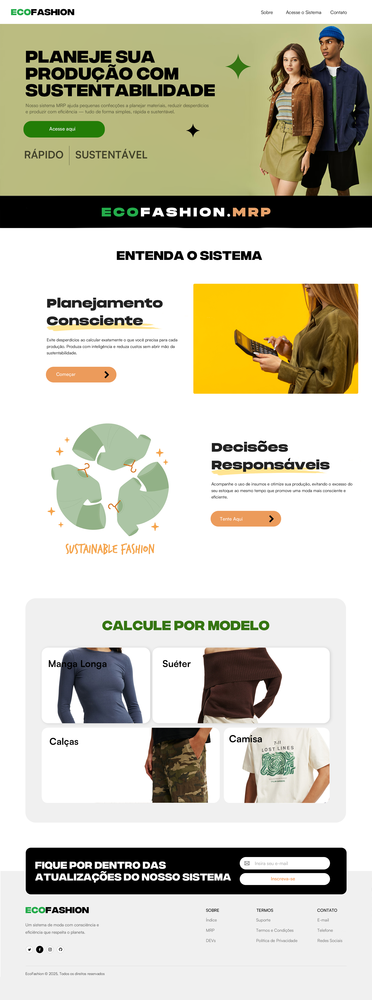
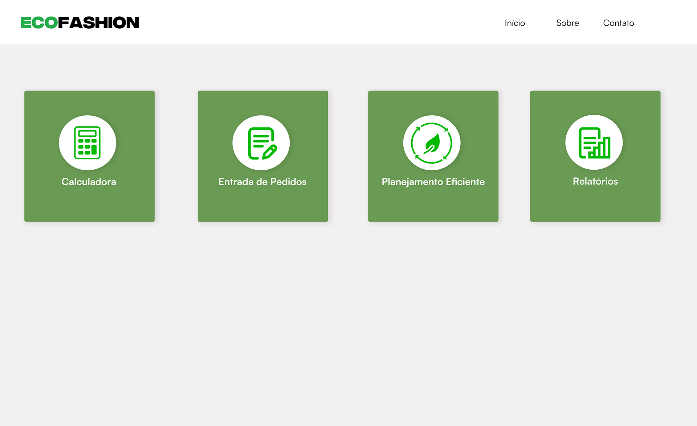
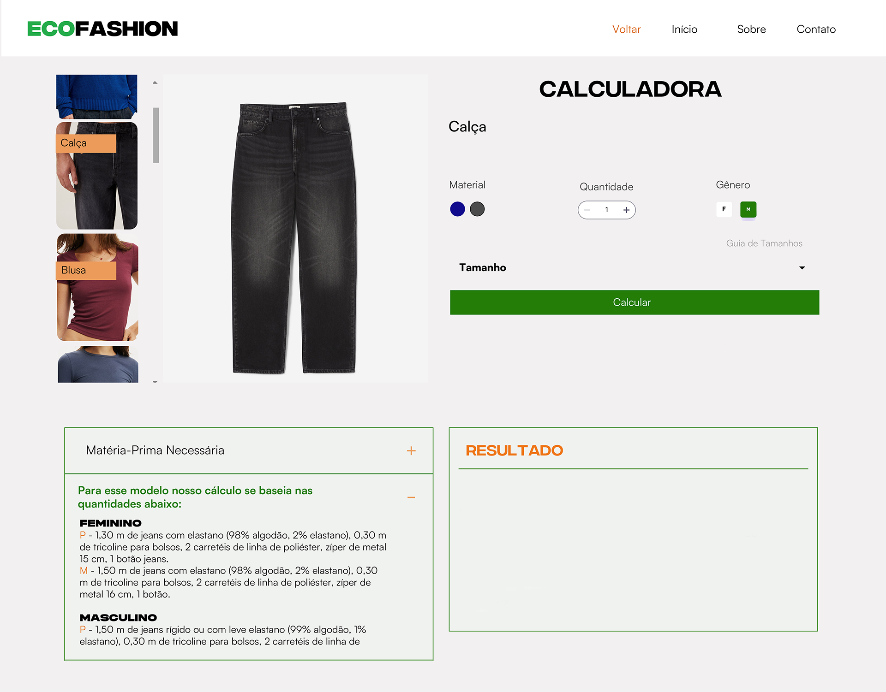

# Projeto de Interface

Pré-requisitos: <a href="2-Especificação.md"> Documentação de Especificação</a>

> O design e template do nosso wireframe foi desenvolvido através do Photoshop,
> englobando os requisitos do sistema utilizado (MRP),
> atendendo os principais recursos para pequenas empresas ou pequenos fabricantes que
> querem simular o preço de forma rápida e sustentável da sua produção de roupas.
> 
> Projeto](2-Especificação.md).

## Wireframes
*Figura 1 - Página inicial do sistema*

*Figura 2 - Interface do Menu com as Opções do Sistema*

*Figura 3 - Página da Calculadora*

